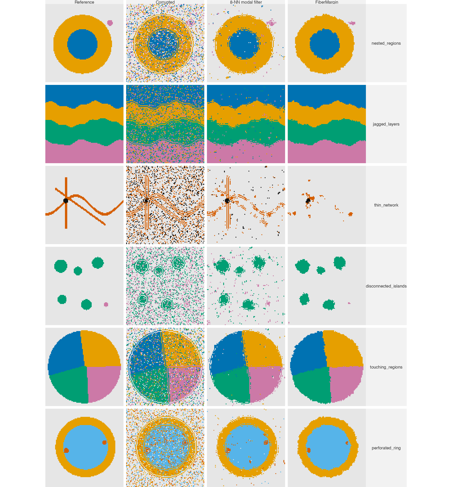
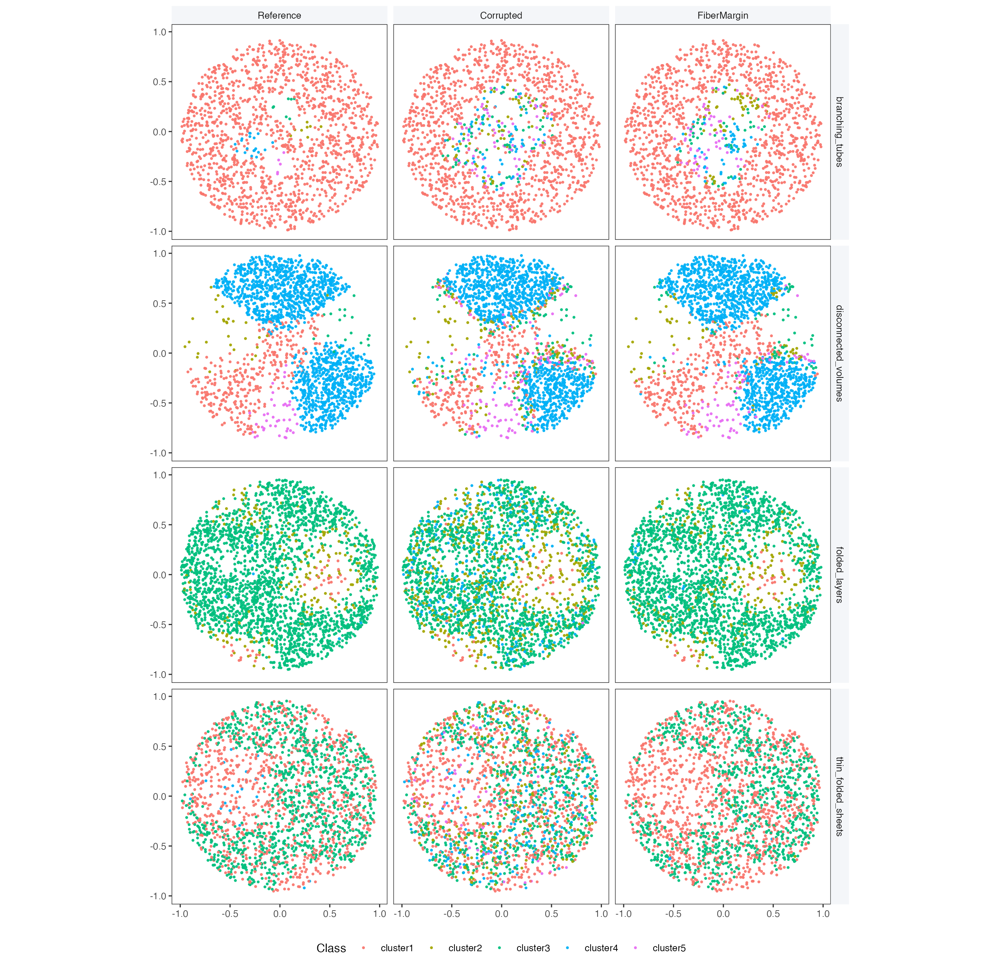

# Exact operator specification

This supplement specifies the single production implementation used in the
predefined evaluations. The public R function is
`refine_spatial_labels(xy, labels, samples = NULL, workers = NULL)`. It accepts
two or three coordinates, one observed categorical field, and optional specimen
membership. `workers` is one total native CPU budget and changes execution only;
it is not multiplied by the number of specimens.

Every specimen is processed independently, with a local class encoding. The C++ core first chooses the best
candidate class from a rival-versus-observed contrast and changes a label only
when that contrast clears its candidate-specific barrier. Exact class-evidence
ties retain the observed label.

For each specimen, zero-range coordinate axes are removed first. Every remaining
axis is mapped from its empirical first and ninety-ninth percentiles to the unit
interval and then clipped to $[-0.1,1.1]$. At least two varying axes must remain.
Consequently, constant-$z$ input invokes exactly the 2D operator, whereas
genuinely three-dimensional input uses all three coordinates. The multiclass
implementation is fixed as follows.

| Component | Fixed specification |
|:--|:--|
| Path atlas | 9 rotations in 2D; 12 rotations in 3D |
| Path index | 16-bit Hilbert code after rotation and viewwise unit-box scaling |
| Reference step | Median positive Euclidean step along a path |
| Local path gap | Geometric mean of adjacent path steps at an interior location; the available step at an endpoint |
| Transport action | $h=\Delta/r$ |
| Query isolation | $\omega=\max\{1,q/r\}$; used only in the acceptance barrier |
| Source evidence | One unit for the observed class at every source location |
| Transport range | One fixed range, $\lambda=5$ |
| Path field | $H=(\sqrt L+\sqrt R)^2$, normalized over classes within each path |
| Atlas evidence | Mean rival-versus-observed path contrast |
| Atlas disagreement | $A^{-1}\{\sum_a(m_a-\bar m)^2\}^{1/2}$ |
| Class adjustment | $\delta_c=\sqrt{n_{\mathrm{med}}/\max(n_c,1)}$ |
| Acceptance | A distinct candidate is accepted when its margin is at least its barrier |

At an interior path location $i=\pi_a(t)$, let
$q_{ai}=\sqrt{\Delta_{a,t-1}\Delta_{at}}$; at an endpoint use the available
step. The action and isolation are

$$
h_{at}=\frac{\Delta_{at}}{r_a},\qquad
\omega_{ai}=\max\left\{1,\frac{q_{ai}}{r_a}\right\}.
\tag{S1}
$$

Define $z_{ajc}=\mathbf{1}\{\widetilde y_j=c\}$. With $D^+_a(i,j)$ and
$D^-_a(i,j)$ the implemented sums of directed actions, the forward and reverse
states are

$$
L_{aic}=\sum_{j\prec_a i}e^{-D^+_a(i,j)/5}z_{ajc},\qquad
R_{aic}=\sum_{j\succ_a i}e^{-D^-_a(i,j)/5}z_{ajc}.
\tag{S2}
$$

The strict path inequalities encode leave-self-out evidence: the observed label
at a query is inserted only after its directional state has been read. The
two-sided field is

$$
H_{aic}=(\sqrt{L_{aic}}+\sqrt{R_{aic}})^2,\qquad
p_{aic}=\frac{H_{aic}}{\max\{\sum_r H_{air},10^{-12}\}}.
\tag{S3}
$$

## Two-sided amplitude characterization

The square-root exponent is fixed within a deliberately narrow field class. Let
$g:[0,\infty)\to[0,\infty)$ with $g(0)=0$, and suppose a two-sided field is
constructed by adding directional amplitudes before squaring:

$$
F(L,R)=(g(L)+g(R))^2.
$$

If the construction must retain one-sided evidence exactly, namely
$F(L,0)=L$ and $F(0,R)=R$, then necessarily

$$
g(u)^2=u,
\qquad g(u)=\sqrt{u},
\qquad F(L,R)=(\sqrt L+\sqrt R)^2.
$$

The conclusion follows immediately by setting the other directional state to
zero; nonnegativity selects the positive root. Thus the square-root rule is not
an arbitrary barrier power within this amplitude-addition construction. This
characterization applies to the unnormalized field only. It neither derives nor
justifies the separate numerical clipping, per-path normalization, atlas size,
rotations, or transport range, which remain fixed implementation choices and
are audited separately.

The path contrast is $m_{aic}=p_{aic}-p_{ai,\widetilde y_i}$, its atlas mean
is $m_{ic}=A^{-1}\sum_a m_{aic}$, and the implemented chart-ensemble
chart-disagreement scale is

$$
s_{ic}=\frac{1}{A}\left\{\sum_a(m_{aic}-m_{ic})^2\right\}^{1/2}.
\tag{S4}
$$

This is the empirical population standard deviation of the deterministic chart
contrasts divided by $\sqrt A$; it is descriptive and is not interpreted as a
calibrated confidence interval.

For observed class count $n_c$ and median positive class count $n_{\mathrm{med}}$,
the acceptance barrier is

$$
\delta_c=\sqrt{\frac{n_{\mathrm{med}}}{\max(n_c,1)}},\qquad
B_{ic}=\frac{s_{ic}\,\omega_i}{\delta_c},
\quad \omega_i=\operatorname{median}_a\omega_{ai}.
\tag{S5}
$$

Thus transport uses plain geometric path length and unit class evidence. Local
isolation protects a query only when its supporting path gaps are larger than
typical. Neither term is a probability, confidence score, or learned density
model. Returned
diagnostics are `candidate`, `margin_score`, `required`, `repair_margin`,
`atlas_dispersion`, `isolation`, and `changed`.
The factor also carries per-specimen `dimensions_used`, `labels_changed`,
`changed_fraction`, `classes_before`, `classes_after`, `removed_classes`, and
`sample_sizes`, plus the total `workers` budget. No class-count constraint is
applied. A specimen with fewer than two varying axes is rejected because no
supported 2D or 3D spatial operator can be constructed.

## Binary specialization

For two observed classes, a specimen with fewer than 20 locations, or fewer
than two observed classes, is retained unchanged. Otherwise the code obtains
$k_d=\min(|I_s|-1,2^{d+4})$ nearest other locations and counts their two labels.
The strict ballot majority is the candidate; ties retain the observed label.
For a distinct candidate, the evidence is its vote count minus the observed
vote count and the barrier is one. The binary branch returns `isolation = 1` and
`atlas_dispersion = 0`. It is a fixed specialization of the same public
candidate-first decision, not a user-selectable second method. Because there is
exactly one rival, the signed local count difference exhausts the local candidate
comparison; multiclass path normalization is not needed to choose among several
rival classes.

# Comparator information contract

Every method in the predefined matrices receives coordinates, one observed
categorical field, and specimen membership only. No method receives a reference
annotation, expression matrix, image, feature vector, confidence map, or trusted
seed at repair time.

The primary comparison is Pareto non-domination in the triplet of accuracy,
ARI, and correction damage. A method dominates another only if it has at least
as high accuracy and ARI and no greater damage, with one strict inequality. This
predeclared relation is used to describe operating points rather than to create
a post-hoc scalar rank. All other reported scores are retained as diagnostics of
the resulting trade-offs.

| Method | Fixed benchmark specification |
|:--|:--|
| FiberMargin | Multiclass: 9/12 Hilbert charts, range 5, two-sided enclosure; binary: $2^{d+4}$-nearest ballot |
| Alpha-expansion Potts | 8 neighbours; unary 5; 3 cycles |
| Coordinate CRF | 16 neighbours; fixed unary and beta; 8 iterations |
| Harmonic propagation | 24 neighbours; retention 0.20; 12 iterations |
| Multiscale mode | 6, 14, and 30 neighbours; retention 0.20 |
| Potts ICM | 8 iterations; fixed consensus and preservation |
| SpaGCN correction | Fixed 6-neighbour post-hoc correction rule |
| GraphST correction | Fixed 50-neighbour post-hoc correction rule |
| 8-NN modal filter | One-pass 8-neighbour mode |

SpaGCN and GraphST are evaluated as fixed post-hoc controls, not as their
feature-guided domain-discovery workflows [@hu2021; @long2023].

The four configurable controls were calibrated once on 24 non-overlapping
2D/3D development fields. Candidate grids contained 18 alpha-expansion, 27
coordinate-CRF, 18 harmonic, and three multiscale settings. Within each family,
the retained setting maximized mean accuracy subject to the same absolute
damage cap of 0.05, with ARI breaking ties. The selected settings are exactly
those in the table above. The archived calibration summary, all 1,584
case-setting rows, and manifest make the choice auditable; neither FiberMargin's
damage nor any reported evaluation panel defines the cap.

# Matched enclosure controls

The enclosure field is the only quantity changed in this audit. All paths,
geometric actions, query isolation, class adjustment, and acceptance terms are
held fixed. The matched additive control removes only the square-root cross
term after the directional recurrences have computed $L$ and $R$:

$$
L+R+2\sqrt{LR}
\quad\text{versus}\quad
L+R.
$$

The comparison uses all 60 CRC and 45 MERFISH predefined conditions under the final
chart-disagreement admission rule.
Repeated corruptions from a common reference annotation are descriptive units,
not independent biological specimens. Table S1 records the source-matched
retrospective mechanism comparison.

| Dataset | Units | Square-root Acc. | Additive Acc. | Square-root ARI | Additive ARI | Square-root damage | Additive damage |
|:--|--:|--:|--:|--:|--:|--:|--:|
| CRC | 60 | 0.85890 | 0.85881 | 0.78062 | 0.78054 | 0.04777 | 0.04808 |
| MERFISH | 45 | 0.89053 | 0.88925 | 0.80044 | 0.79873 | 0.03670 | 0.03784 |

**Table S1.** Source-matched mechanism comparison of the two-sided
enclosure field. Higher is better except for damage. The additive field
is near-tied on CRC but has lower primary scores and higher damage on both
panels. The complete mechanism and evaluation ledgers record every fixed field
replacement and secondary outcome. Both panels are multiclass; the binary
specialization is not evaluated.

# Fixed atlas-and-range sensitivity audit

A development audit changes one geometric constant at a time while retaining
the two-sided field and admission rule. It compares nested 7/9, 9/12, 11/15,
and 13/18 path atlases at range 5, a longer range, and a
dimension-dependent range. The panel contains 50 predefined real-coordinate
corruptions and six geometry-diverse simulations. The 9/12 atlas is the
smallest expansion that improves the real-panel accuracy and ARI averages. The
11/15 and 13/18 atlases improve those averages further, but progressively
increase damage; on the 20-case CRC development subset they also reduce
sparse-region accuracy by 0.0263 and 0.0378 relative to 7/9.
Because the 50 real-coordinate fields are subsets of the final study panels,
this is a configuration audit rather than an independently held-out comparison.

The 9/12 atlas was then confirmed on all 150 real-coordinate fields, 708
complete simulations, and 108 unseen geometries. It improves accuracy and ARI
on every real-coordinate dataset and both broad simulation ledgers. The
released setting therefore uses 9/12 paths with range 5. This is a fixed
cross-panel operating point, not a theorem-determined optimum.

| Panel or dataset | 9/12 accuracy change | 9/12 ARI change | 9/12 damage change |
|:--|--:|--:|--:|
| Development real panel, 50 fields | +0.00085 | +0.00154 | +0.00136 |
| DLPFC confirmation, 45 fields | +0.00199 | +0.00294 | +0.00011 |
| CRC confirmation, 60 fields | +0.00015 | +0.00035 | +0.00205 |
| MERFISH confirmation, 45 fields | +0.00061 | +0.00156 | +0.00141 |
| Complete simulation, 708 fields | +0.00095 | +0.00193 | +0.00106 |
| Unseen geometry, 108 fields | +0.00161 | +0.00262 | +0.00063 |

**Table S1A.** Source-matched 9/12-atlas changes relative to the 7/9 atlas.
Positive accuracy and ARI changes are improvements; positive damage is worse.
The full case-level ledgers also report boundary, sparse-region, worst-class,
and correction outcomes. This is an audit of the multiclass enclosure atlas;
the binary specialization has no path atlas.

The remaining internal quantities have distinct roles.  The 16-bit Hilbert
code is a numerical representation rather than a fitted statistical parameter:
after unit-box scaling, one quantization cell has coordinate width at most
$1/(2^{16}-1)$.  Rotations are generated deterministically by the low-discrepancy
irrational schedules in the source.  The barrier has no fitted multiplier: its
units are the chart contrast dispersion times the local-gap factor, divided by
the square-root class-amplitude adjustment.  Robust 1st--99th percentile
normalization, the chart count, and the central range remain pragmatic fixed
defaults, with their complete fixed-configuration sensitivity records included
here.

## Chart-interior and limitation-map audit

This independent 48-field audit asks whether the explicit local premise of
Theorem S2 is informative in irregular spatial fields and where released
FiberMargin gains or loses against its direct controls. It is not a source
selection study. The saved panel contains 24 two-dimensional and 24
three-dimensional five-class fields. The 2D fields use tubular-network or
braided-channel geometry, uniform or extreme sampling, random, boundary, or
patch corruption, and 10% or 30% corruption. The 3D fields use folded layers or
branching tubes, uniform or class-imbalanced sampling, random, boundary, or
regional corruption, and the same rates. Each 2D field has 3,000 locations and
each 3D field 4,000; the 48 seeds, inputs, and design table are saved in the
result archive.

A benchmark-only C++ diagnostic reproduces the released robust normalization,
rotations, 16-bit Hilbert code, tie order, and 9/12-path atlas. After repair, it
uses the reference field only to count consecutive same-reference-class
locations immediately on both sides of each query in every chart. The all-chart
run length is the minimum of these two-sided runs. Consequently, the exact
$q$-chart-interior condition in Theorem S2 holds if and only if that recorded
length is at least $q$. No diagnostic quantity enters repair. Table S1B gives
the resulting reference-based strata.

| $q$ | All-chart prevalence | Accuracy, inside/outside | Correction recall, inside/outside | Damage, inside/outside |
|--:|--:|:--|:--|:--|
| 1 | 0.5240 | 0.9390 / 0.7992 | 0.5481 / 0.4358 | 0.00078 / 0.06050 |
| 2 | 0.4057 | 0.9450 / 0.8223 | 0.6000 / 0.4483 | 0.00044 / 0.04854 |
| 3 | 0.3366 | 0.9475 / 0.8335 | 0.5917 / 0.4542 | 0.00044 / 0.04348 |
| 4 | 0.2889 | 0.9502 / 0.8398 | 0.6127 / 0.4574 | 0.00035 / 0.04059 |

**Table S1B.** Exact reference-based chart-interior strata in the fresh 48-field
audit. Values are means over saved fields. The condition has no repair-time use.
Locations deeper in all released paths have higher conditional recovery and much
lower conditional damage, an empirical association coherent with the theorem's
local premise. It is not a verification of its independent-noise assumptions,
which do not describe the structured corruption mechanisms in this panel. All
fields are multiclass and use the enclosure mechanism.

The same fields compare released FiberMargin with alpha-expansion Potts,
coordinate CRF, self-anchored harmonic propagation, and multiscale mode. All
five methods receive the same coordinates and observed categorical field. A
positive difference favors FiberMargin except for damage, where a negative value
is preferable. Table S1C summarizes the paired method comparisons.

| Direct control | Accuracy difference | ARI difference | Correction recall difference | Damage difference | Accuracy win fraction |
|:--|--:|--:|--:|--:|--:|
| Alpha-expansion Potts | +0.00606 | +0.01140 | +0.07634 | +0.01190 | 0.604 |
| Coordinate CRF | +0.04587 | +0.07206 | +0.28655 | +0.02470 | 0.750 |
| Harmonic propagation | +0.01525 | +0.05078 | +0.05260 | -0.00181 | 0.792 |
| Multiscale mode | +0.00772 | +0.00974 | +0.04237 | +0.00397 | 0.604 |

**Table S1C.** Paired mean FiberMargin-minus-control outcomes on the fresh
48-field audit. The win fraction is the fraction of fields with higher
FiberMargin accuracy. The CRF comparison illustrates an operating-point tradeoff:
FiberMargin gains accuracy and correction recall while causing more damage. All
FiberMargin results use the multiclass enclosure mechanism.

Against the post-hoc best of the four direct controls, FiberMargin leads in
18/48 fields (37.5%), with mean accuracy difference $-0.00362$. The factor map
therefore reports a limitation as well as positive regimes: the mean difference
is $-0.01308$ for 10% 2D patch corruption and +0.00950 for 30% 3D random
corruption. The observed
agreement and local-density descriptors are recorded for every field, but no
threshold, learned selector, pre-repair applicability score, or new package
input is introduced.

## Geometric bridge audit

The same predefined fields support a second benchmark-only diagnostic for Lemma 1.
For each query and $q\in\{1,2\}$, it reconstructs the released robust
normalization, rotations, code values, stable tie ordering, and chart spans.
It then computes the finite Hilbert-block radius $\rho_{iq}$ from the proof and
the exact maximum Euclidean distance to every required atlas witness. Reference
labels are read only after the released repair call to measure nearest
different-class separation. Neither quantity is returned by the package or used
to choose a method.

| $q$ | Exact interior | Code-gap certificate | Precision | Interior coverage | Direct-witness certificate | Finite queries | Max direct/bound |
|--:|--:|--:|--:|--:|--:|--:|--:|
| 1 | 0.5518 | 0.0881 | 1.0000 | 0.1421 | 0.4425 | 167254 | 0.8557 |
| 2 | 0.4307 | 0.0406 | 1.0000 | 0.0804 | 0.3219 | 166524 | 0.8576 |

**Table S1D.** Deterministic Euclidean-to-chart bridge audit. The code-gap
certificate requires reference separation greater than the conservative radius
in Lemma 1. Precision is the fraction of certificate locations satisfying the
exact all-chart predicate; coverage is the fraction of exact interiors carrying
the certificate. `Max direct/bound` is the mean across fields of the
within-field maximum exact witness-radius divided by its finite Hilbert-block
bound. Every finite bound contains every required
witness and every certificate is an exact interior. The certificate is
intentionally conservative: it proves a usable sufficient condition, not a
complete characterization of chart interior. This audit concerns the multiclass
enclosure mechanism, which constructs the chart atlas.

Within the $q=1$ certificate, correction recall is 0.6734 and damage is
0.00042, compared with 0.4550 and 0.03017 outside it. At $q=2$, the corresponding
values are 0.7274 and zero, compared with 0.4575 and 0.02883 outside. These
reference-only strata show that the geometric sufficient condition is
non-vacuous, but they are not a method-selection result.

# Fixed-component audit

Each row below removes one protective term, or doubles the chart-disagreement
barrier, while holding the path atlas, range, and stored inputs fixed. Deltas are
relative to FiberMargin; positive damage is worse. The final operator is a
cross-panel compromise: removing class adjustment, query isolation, or the
default chart-disagreement admission rule can improve a primary score in one panel, but each
removal either damages CRC accuracy or weakens sparse-region protection while
raising damage.

| Dataset | Operator change | Accuracy change | ARI change | Sparse accuracy change | Damage change |
|:--|:--|--:|--:|--:|--:|
| CRC | Class adjustment | -0.0059 | -0.0086 | -0.0712 | +0.0222 |
| CRC | Query isolation | -0.0010 | -0.0009 | -0.0274 | +0.0050 |
| CRC | Doubled admission barrier | +0.0008 | +0.0002 | +0.1269 | -0.0201 |
| MERFISH | Class adjustment | +0.0012 | +0.0014 | -0.0011 | +0.0017 |
| MERFISH | Query isolation | -0.0003 | -0.0004 | -0.0029 | +0.0026 |
| MERFISH | Doubled admission barrier | -0.0029 | -0.0074 | +0.0102 | -0.0130 |

**Table S2.** Component ablations across predefined real-coordinate corruptions.
The complete case-level ledger records all secondary outcomes and the literal
operator changes. Table S2 makes the cross-panel trade-off explicit. CRC and
MERFISH are multiclass and therefore use the enclosure mechanism.

# Fixed atlas-size audit

The production atlas uses nine 2D and twelve 3D paths. The following audit
recompiles only those constants while leaving the field, barrier, stored inputs,
and score code unchanged. The 1/1 variant is a simple reference-path control:
it retains one Hilbert traversal, two-sided transport, and the same acceptance
rule, but removes chart ensembling. Timings are therefore comparable within this
literal source-variant harness, but not with times measured by a different
benchmark driver. Because it uses the same panels as the reported matrix, it is
a sensitivity analysis rather than independent selection evidence. The 9/12
setting is the released operating point: one path has much poorer primary and
damage outcomes, 7/9 is close but lower in accuracy and ARI, and the 5/6 atlas
trades lower runtime for lower primary scores.

Table S3 reports the fixed atlas-size audit.

| Dataset | Atlas | Accuracy | ARI | Damage |
|:--|:--|--:|--:|--:|
| CRC | 1/1 path | 0.8242 | 0.7297 | 0.11684 |
| CRC | **9/12 paths** | **0.8589** | **0.7806** | **0.04777** |
| CRC | 7/9 paths | 0.8587 | 0.7803 | 0.04573 |
| CRC | 5/6 paths | 0.8582 | 0.7793 | 0.04387 |
| MERFISH | 1/1 path | 0.8517 | 0.7315 | 0.09521 |
| MERFISH | **9/12 paths** | **0.8905** | **0.8004** | **0.03670** |
| MERFISH | 7/9 paths | 0.8899 | 0.7989 | 0.03530 |
| MERFISH | 5/6 paths | 0.8872 | 0.7939 | 0.03559 |

**Table S3.** Fixed atlas-size audit on the same 60 CRC and 45 MERFISH
corruptions per literal variant. The 1/1 row is the simple one-Hilbert-path
control. Accuracy and ARI are higher-is-better; damage is lower-is-better.
Runtime is reported in the common-harness timing table rather
than this parallel source-variant audit. This audit concerns only the multiclass
enclosure mechanism; the binary specialization has no atlas-size setting.

# Binary interior recovery guarantee

This proof concerns the implemented binary ballot. Work in the robustly
normalized coordinate domain. Fix a query $i$ in a specimen of size $m$ whose
reference label is $t$, and suppose a Euclidean ball $\mathcal B(x_i,r)$ lies
inside the true-$t$ region. If conditional coordinate density in the ball is at
least $f_{\min}$, let $v_d$ be the unit $d$-ball volume,
$k=\min(m-1,2^{d+4})$, and

$$
\mu=(m-1)f_{\min}v_dr^d\ge2k.
\tag{S6}
$$

Assume conditional independent locations and independent flips of true-$t$
neighbour labels with probability at most $p<1/2$.

**Theorem S1 (binary interior recovery).** Under these conditions, the binary
branch returns $t$ at $i$ with probability at least

$$
1-e^{-\mu/8}-e^{-2k(1/2-p)^2}.
\tag{S7}
$$

**Proof.** Let $Z$ count the other locations in the ball. Since
$\mathbb E Z\ge\mu$, a multiplicative Chernoff bound gives
$\Pr(Z<k)\le e^{-\mu/8}$. On $Z\ge k$, all $k$ nearest neighbours lie in the
ball and have reference class $t$. Let $W$ count their observed $t$ labels.
Hoeffding's inequality gives
$\Pr(W\le k/2)\le e^{-2k(1/2-p)^2}$. Outside those events, $t$ has a strict
ballot majority. If $i$ already has label $t$, it is retained; otherwise its
positive integer vote margin clears the implemented unit barrier. A union bound
proves (S7). $\square$

The result is local to a true-region interior. It makes no claim at a boundary,
in a density void, or after a class has disappeared from the observed field.

# Euclidean-to-chart bridge

The multiclass theorem requires same-reference-class witnesses immediately on
both sides of every released path. This section gives a deterministic geometric
sufficient condition for that witness event. It uses the same robustly
normalized coordinate system as the production implementation, not raw
measurement units.

Fix a chart $a$ and write $u_{ai}$ for its rotated, viewwise unit-box-scaled
coordinate of query $i$. Let $c_{a1}\le\cdots\le c_{am}$ be the 16-bit Hilbert
codes in the implementation's stable sort order, and let $p_a(i)$ be the
position of $i$. Let $s_a$ be the largest coordinate span before this viewwise
rescaling. For a requested run length $q$ with sources on both sides, define

$$
g_{aiq}=\max\{c_{a,p_a(i)}-c_{a,p_a(i)-q},
                 c_{a,p_a(i)+q}-c_{a,p_a(i)}\},
\qquad
r_{aiq}=\min\{r\ge0:2^{dr}\ge g_{aiq}+1\},
$$

and

$$
\rho_{iq}=\max_a\left\{s_a\sqrt{d+3}\,
\frac{2^{r_{aiq}}}{2^{16}-1}\right\}.
$$

If a path lacks $q$ sources in either direction, set $\rho_{iq}=\infty$.
The code-gap radius depends only on coordinates, chart geometry, and stable
input order; it has no reference-label or repair-time role.

**Lemma S2A (Euclidean-to-chart bridge).** Let the true region for class $t$
contain $\mathcal B(x_i,\rho_{iq})$ in the robust coordinate system. Then the
first $q$ released path sources in each direction of every chart have reference
class $t$. Hence $i$ is $q$-chart-interior.

**Proof.** The finite 16-bit code is the standard recursive Hilbert traversal
implemented through the Skilling transform [@skilling2004]. A consecutive code
interval of $g_{aiq}+1\le2^{d r_{aiq}}$ cells intersects at most two aligned
level-$r_{aiq}$ Hilbert blocks. Consecutive blocks in that traversal share a
face. Each block has side at most
$2^{r_{aiq}}/(2^{16}-1)$ in unit-chart coordinates. The union of two
face-adjacent $d$-cubes of side $h$ has Euclidean diameter
$h\sqrt{d+3}$. Thus every one of the $2q$ required sources in chart $a$ lies
within

$$
s_a\sqrt{d+3}\,\frac{2^{r_{aiq}}}{2^{16}-1}
$$

of $x_i$: the inverse rotation preserves Euclidean norm and the inverse
coordinate-wise rescaling has operator norm at most $s_a$. Taking the maximum
over charts gives $\rho_{iq}$. The assumed ball containment therefore gives
reference class $t$ to every required source, exactly the chart-interior
predicate. $\square$

The lemma removes no other multiclass assumption. In particular, action bounds,
independent source-label noise, class balance, and the acceptance inequality
remain necessary for Theorem S2. It is a geometric bridge to the witness event,
not a claim that a Euclidean ball makes the complete recovery theorem hold.

# Multiclass chart-interior recovery guarantee

This result concerns the implemented multiclass recurrence.  Work within one
specimen and fix a query $i$ with reference class $t$.  In chart $a$, enumerate
the source locations before and after the query as
$j_{a\ell}^{-}$ and $j_{a\ell}^{+}$, with $\ell=1,2,\ldots$, and write
$D_{a\ell}^{-}$ and $D_{a\ell}^{+}$ for their exact accumulated implemented
path actions.  The query is *$q$-chart-interior* if

$$
y^*_{j_{a\ell}^{-}}=y^*_{j_{a\ell}^{+}}=t
\qquad (a=1,\ldots,A;\ \ell=1,\ldots,q).
\tag{S8}
$$

This is an explicit region-and-boundary condition.  It requires $q$ sampled
same-class witnesses on both sides of every chart, rather than an assumption on
the candidate returned by FiberMargin.  Assume that, for constants
$0<a\le b$, all source actions obey
$D_{a\ell}^{\pm}\ge\ell a$, while the chart-interior sources obey
$D_{a\ell}^{\pm}\le\ell b$.  The first condition controls the total remote
mass; the second is a local sampling-density condition.  Conditional on the
reference field, assume the observed source labels are independent and, for
every chart-interior source and rival $c\ne t$,

$$
\Pr(\widetilde y=t)\ge1-p,
\qquad\Pr(\widetilde y=c)\le p,
\qquad 0\le p<1/2.
\tag{S9}
$$

Let $\lambda$ be the fixed central range used by the implementation and define

$$
W_q(b)=\sum_{\ell=1}^q e^{-\ell b/\lambda},
\qquad
V_q(a)=\sum_{\ell=1}^q e^{-2\ell a/\lambda}.
$$

$$
T_q(a)=\sum_{\ell=q+1}^{\infty}e^{-\ell a/\lambda},
\qquad
U(a)=\sum_{\ell=1}^{\infty}e^{-\ell a/\lambda}.
$$

$$
\gamma=(1-2p)W_q(b)-\epsilon-T_q(a),
\qquad
Q(a)=\max\{4U(a),10^{-12}\},
\qquad
m_0=4\gamma/Q(a).
\tag{S10}
$$

Here $W_q$ is guaranteed same-class support, $T_q$ is the worst-case remote
rival mass, and $U$ bounds either complete directional state.  Let
$\omega_i\le\Omega$ be the implemented local-gap factor at $i$ and suppose
the observed class adjustment of the true candidate obeys
$\delta_t\ge\delta_0>0$.  The deterministic acceptance condition is

$$
\gamma>0,
\qquad
m_0\ge\frac{\Omega(1-m_0)}{2\delta_0\sqrt A}.
\tag{S11}
$$

**Theorem S2 (multiclass chart-interior recovery).** Under (S8)--(S11), the
implemented multiclass branch returns $t$ at $i$ with probability at least

$$
1-2A(C-1)\exp\left\{-\frac{\epsilon^2}{2V_q(a)}\right\}.
\tag{S12}
$$

The statement covers both retention of an observed $t$ and correction when the
observed query class differs from $t$.

**Proof.** Fix one chart, one direction, and one rival $c\ne t$.  For the
first $q$ sources, let $w_\ell=e^{-D_{a\ell}^{\pm}/\lambda}$ and
$Z_\ell=\mathbf1\{\widetilde y_{j_{a\ell}^{\pm}}=t\}-
\mathbf1\{\widetilde y_{j_{a\ell}^{\pm}}=c\}$.  By (S8)--(S9),
$\mathbb E Z_\ell\ge1-2p$; by the action bounds,
$\sum_{\ell=1}^q w_\ell\ge W_q(b)$ and
$\sum_{\ell=1}^q w_\ell^2\le V_q(a)$.  Weighted Hoeffding therefore gives

$$
\Pr\left\{\sum_{\ell=1}^q w_\ell Z_\ell
<(1-2p)W_q(b)-\epsilon\right\}
\le\exp\left\{-\frac{\epsilon^2}{2V_q(a)}\right\}.
\tag{S13}
$$

The contribution of all remaining sources to the true-minus-rival directional
state is at least $-T_q(a)$.  Hence outside the event in (S13), each directional
state satisfies $L_t-L_c\ge\gamma$ and $R_t-R_c\ge\gamma$.  Because

$$
\sqrt{(u+\gamma)(v+\gamma)}\ge\sqrt{uv}+\gamma
\qquad(u,v,\gamma\ge0),
\tag{S14}
$$

the exact implemented enclosure field obeys $H_t-H_c\ge4\gamma$.  Also
$H_c\le2(L_c+R_c)$ and each directional total is at most $U(a)$, so its
normalizer is at most $Q(a)$.  Thus every chart has
$p_t-p_c\ge4\gamma/Q(a)=m_0$.  A union bound over two directions, $A$ charts,
and $C-1$ rivals gives (S12).

If the observed query class is $t$, it is already the unique candidate and is
retained.  Otherwise, every chart contrast for candidate $t$ lies in
$[m_0,1]$.  Popoviciu's variance bound and the exact definition in Equation (7)
give $s_{it}\le(1-m_0)/(2\sqrt A)$. Therefore the implemented barrier satisfies

$$
B_{it}=\frac{\omega_i s_{it}}{\delta_t}
\le\frac{\Omega(1-m_0)}{2\delta_0\sqrt A}\le m_0\le E_{it}.
\tag{S15}
$$

The candidate-first rule in Equation (D) consequently returns $t$.
$\square$

The theorem is deliberately local.  Chart interior is a testable path-level
form of boundary distance and sampling density; it is not claimed to follow
automatically from Hilbert ordering on every geometry.

# Multiclass enclosure stability

This result concerns two complete observed fields on fixed coordinates and
specimen membership. It is a finite-input stability statement, not a
consistency result or a latent-label generative model. Let the two fields agree
at query $i$, and let $S$ be their changed locations.

For each chart and class, write
$\varepsilon^+_{aic}=|L'_{aic}-L_{aic}|$ and
$\varepsilon^-_{aic}=|R'_{aic}-R_{aic}|$. With $M_{aic}$ the maximum of the
four directional states, the square-root inequality gives

$$
\kappa_{aic}=\varepsilon^+_{aic}+\varepsilon^-_{aic}
+2\sqrt{M_{aic}}\left(\sqrt{\varepsilon^+_{aic}}
+\sqrt{\varepsilon^-_{aic}}\right),
\tag{S16}
$$

and $|H'_{aic}-H_{aic}|\le\kappa_{aic}$. The directional differences are
bounded directly by the affected sources, for example

$$
\varepsilon^+_{aic}\le
\sum_{\substack{j\prec_a i\\j\in S}}
e^{-D^+_a(i,j)/5}|z'_{ajc}-z_{ajc}|,
\tag{S17}
$$

with the symmetric reverse bound. Let
$T_{ai}=\max\{\sum_cH_{aic},10^{-12}\}$,
$\tau_{ai}=\min(T_{ai},T'_{ai})$, and
$\kappa_{ai}=\max_c\kappa_{aic}$. Since
$|T'_{ai}-T_{ai}|\le C\kappa_{ai}$,

$$
|p'_{aic}-p_{aic}|\le\frac{(C+1)\kappa_{ai}}{\tau_{ai}}.
\tag{S18}
$$

Consequently, with

$$
\rho_i=\frac1A\sum_{a=1}^A
\frac{2(C+1)\kappa_{ai}}{\tau_{ai}},
\tag{S19}
$$

we have $\max_c|m'_{ic}-m_{ic}|\le\rho_i$. The chart dispersion is
$s_{ic}=\|P(m_{aic})_{a=1}^A\|_2/A$, so the reverse triangle inequality gives

$$
|s'_{ic}-s_{ic}|\le
\frac1A\left\|(m'_{aic}-m_{aic})_{a=1}^A\right\|_2.
\tag{S20}
$$

The isolation $\omega_i$ is coordinate-derived and unchanged under this
comparison. The exact barrier is $B_{ic}=\omega_i s_{ic}/\delta_c$, hence

$$
|B'_{ic}-B_{ic}|\le\omega_i\left[
\frac{|s'_{ic}-s_{ic}|}{\delta_c}+
s'_{ic}\left|\frac{1}{\delta'_c}-\frac{1}{\delta_c}\right|
\right].
\tag{S21}
$$

**Theorem S3 (finite-input enclosure stability).** If the unperturbed best
candidate has a margin gap greater than $2\rho_i$, it is unchanged. If its
candidate-versus-barrier clearance exceeds
$\rho_i+\zeta_i$, where
$\zeta_i=\max_c|B'_{ic}-B_{ic}|$, the retain/change decision is unchanged.

**Proof.** Equation (S17) bounds each directional state; (S16) bounds the
enclosure field; and (S18) bounds its normalized class fraction. The two
contrasts in a rival-versus-observed difference give (S19). Equation (S20)
and the exact barrier form give (S21). A margin gap larger than $2\rho_i$
preserves the candidate, while a clearance larger than $\rho_i+\zeta_i$
preserves the sign of its acceptance difference. $\square$

# Predefined real-coordinate evaluation

DLPFC uses 45 interface-band corruptions across 12 Visium sections from three
donors, with 47,329 spots and seven cortical-layer labels. CRC uses five error
rates (5%, 10%, 15%, 25%, and 40%), four mechanisms (random, boundary, patch,
and regional), and three deterministic replicates, for 60 fields over 194,541
locations. MERFISH uses 45 fixed corruptions across five consecutive
hypothalamic planes. Boundary locations have a different reference class among
their eight nearest within-specimen neighbours; sparse locations are the least
prevalent reference class in an evaluation unit.

Table S4 contains the complete native operating-point matrix on the
same stored fields. Accuracy and ARI are primary; correction recall and damage
describe the edit trade-off. Common-harness timing is reported separately in
Table S8 rather than mixing fresh and retained timing runs.

| Dataset | Method | Accuracy | ARI | Correction recall | Damage |
|:--|:--|--:|--:|--:|--:|
| DLPFC | Initial | 0.8100 | 0.6956 | 0.0000 | 0.0000 |
| DLPFC | FiberMargin | 0.8942 | 0.8220 | 0.6387 | 0.0386 |
| DLPFC | Alpha-expansion Potts | 0.8709 | 0.7913 | 0.4100 | 0.0099 |
| DLPFC | Coordinate CRF | 0.8272 | 0.7259 | 0.1529 | 0.0001 |
| DLPFC | Harmonic propagation | 0.8689 | 0.7894 | 0.3960 | 0.0049 |
| DLPFC | Multiscale mode | 0.8785 | 0.8029 | 0.4942 | 0.0155 |
| DLPFC | Potts ICM | 0.8842 | 0.8112 | 0.5067 | 0.0164 |
| DLPFC | SpaGCN correction | 0.8569 | 0.7696 | 0.3702 | 0.0126 |
| DLPFC | GraphST correction | 0.8846 | 0.8058 | 0.7316 | 0.0742 |
| DLPFC | 8-NN modal filter | 0.8566 | 0.7650 | 0.6661 | 0.0909 |
| CRC | Initial | 0.8100 | 0.7085 | 0.0000 | 0.0000 |
| CRC | FiberMargin | 0.8589 | 0.7806 | 0.4444 | 0.0478 |
| CRC | Alpha-expansion Potts | 0.8600 | 0.7815 | 0.4049 | 0.0381 |
| CRC | Coordinate CRF | 0.8100 | 0.7085 | 0.0000 | 0.0000 |
| CRC | Harmonic propagation | 0.8497 | 0.7682 | 0.3442 | 0.0324 |
| CRC | Multiscale mode | 0.8604 | 0.7827 | 0.4105 | 0.0336 |
| CRC | Potts ICM | 0.8503 | 0.7690 | 0.4097 | 0.0434 |
| CRC | SpaGCN correction | 0.8490 | 0.7661 | 0.3113 | 0.0175 |
| CRC | GraphST correction | 0.8081 | 0.7141 | 0.5412 | 0.1321 |
| CRC | 8-NN modal filter | 0.8532 | 0.7707 | 0.5895 | 0.0860 |
| MERFISH | Initial | 0.8100 | 0.6502 | 0.0000 | 0.0000 |
| MERFISH | FiberMargin | 0.8905 | 0.8004 | 0.6172 | 0.0367 |
| MERFISH | Alpha-expansion Potts | 0.8843 | 0.7888 | 0.5093 | 0.0188 |
| MERFISH | Coordinate CRF | 0.8263 | 0.6837 | 0.1542 | 0.0002 |
| MERFISH | Harmonic propagation | 0.8817 | 0.7842 | 0.4698 | 0.0105 |
| MERFISH | Multiscale mode | 0.8823 | 0.7856 | 0.5355 | 0.0223 |
| MERFISH | Potts ICM | 0.8742 | 0.7712 | 0.5043 | 0.0232 |
| MERFISH | SpaGCN correction | 0.8634 | 0.7485 | 0.4206 | 0.0155 |
| MERFISH | GraphST correction | 0.8713 | 0.7798 | 0.6821 | 0.0778 |
| MERFISH | 8-NN modal filter | 0.8695 | 0.7596 | 0.6644 | 0.0719 |

**Table S4.** Complete DLPFC, CRC, and MERFISH operating-point matrix. Higher
is better except for damage. The 45 DLPFC, 60 CRC, and 45 MERFISH corruptions
are not independent biological samples.

# Broad coordinate-only simulation ledgers

The complete simulation ledger crosses dimensions, geometry families, density
profiles, corruption mechanisms, rates, and specimen counts. The unseen-
geometry ledger contains six additional families that are absent from the
complete panel. Both use prespecified deterministic inputs, and all methods
receive the same coordinates and corrupted categorical labels. Table S4A
reports the primary aggregate comparison; complete secondary outcomes and
per-field rows are retained in the result archive.

| Panel | Units | FiberMargin accuracy | Best control accuracy | FiberMargin ARI | Best control ARI |
|:--|--:|--:|--:|--:|--:|
| Complete simulation | 708 | 0.8413 | 0.8302 (Harmonic) | 0.6574 | 0.6328 (Multiscale) |
| Unseen geometry | 108 | 0.8645 | 0.8536 (Harmonic) | 0.7194 | 0.6869 (Multiscale) |

**Table S4A.** Aggregate primary scores on the broad coordinate-only
simulation ledgers. Higher is better. Units are generated fields, not
independent biological samples.

Main Figure 2 places these two ledgers beside the dedicated variable-density
3D panel and shows the full fixed control roster. Table S4B reports descriptive
paired cluster-bootstrap intervals against the strongest aggregate control for
each metric and panel. That control is selected after the full roster is
displayed, so the intervals are not selection-adjusted. Geometry family is the resampling cluster for the
complete and unseen panels; geometry-by-acquisition is the cluster for the
variable-density panel. The comparator is the strongest fixed control mean for
the stated metric, selected descriptively after the full roster was displayed.

| Panel | Accuracy difference (95% interval) | ARI difference (95% interval) | Damage difference (95% interval) |
|:--|:--|:--|:--|
| Complete simulation | +0.0112 (+0.0076, +0.0146) | +0.0251 (+0.0135, +0.0360) | +0.0249 (+0.0123, +0.0405) |
| Unseen geometry | +0.0108 (+0.0078, +0.0147) | +0.0324 (+0.0155, +0.0458) | +0.0218 (+0.0081, +0.0358) |
| Variable-density 3D | +0.0085 (-0.0066, +0.0188) | -0.0010 (-0.0478, +0.0324) | +0.0323 (+0.0174, +0.0542) |

**Table S4B.** Descriptive FiberMargin-minus-strongest-control paired differences
with 10,000 cluster-bootstrap resamples. Harmonic propagation is the accuracy
comparator for the complete and unseen panels; multiscale mode is the ARI
comparator and both primary-score comparators in the variable-density panel.
Coordinate CRF is the lowest-damage comparator. Positive differences favor
FiberMargin for Accuracy and ARI but are worse for Damage. The intervals are not
adjusted for selecting the strongest displayed control and describe variation
across generated geometry clusters, not population-level biological uncertainty.

# Procedural categorical-mask evaluation

The following separate simulation matrix evaluates geometric mask repair rather
than real-coordinate recovery. It contains 108 deterministic 96 by 96 masks:
six families (nested regions, jagged layers, thin networks, disconnected
islands, touching regions, and perforated rings), three geometry seeds, three
corruption mechanisms (impulse, boundary, and patch), and two corruption rates
(15% and 30%). Every method receives only the corrupted categorical mask and
its pixel coordinates; reference masks are used only for scoring. Each
corruption preserves at least one observed exemplar of every class.

For grid masks, a boundary location has a different reference class in its
four-connected neighbourhood. Mean boundary IoU averages, over reference
classes, the IoU of the one-pixel inner boundary bands in the reference and
repaired masks. Rare-class IoU is the IoU of the least prevalent reference
class in the case. The matrix is a controlled geometric stress test, not an
independent biological or upstream-prediction study.

Supplementary Figure 1 shows all eleven methods. FiberMargin has the highest
accuracy, ARI, mean IoU, boundary IoU, and rare-class IoU. The 8-NN modal
filter has higher correction recall, while multiscale mode and alpha-expansion
have lower damage. Table S5 gives the complete aggregate matrix, so these
distinct operating points are visible rather than collapsed into a single rank.

{#fig:procedural-mask-metrics width=95%}

| Method | Accuracy | Mean IoU | Boundary IoU | Rare IoU | ARI | Damage |
|:--|--:|--:|--:|--:|--:|--:|
| FiberMargin | 0.9113 | 0.7743 | 0.4263 | 0.6594 | 0.7392 | 0.0056 |
| Multiscale mode | 0.9043 | 0.7478 | 0.3954 | 0.6015 | 0.7210 | 0.0011 |
| 8-NN modal filter | 0.9023 | 0.7406 | 0.3991 | 0.5763 | 0.7218 | 0.0231 |
| 48-NN modal filter | 0.9070 | 0.7153 | 0.3610 | 0.5101 | 0.7012 | 0.0153 |
| GraphST correction | 0.9059 | 0.7087 | 0.3387 | 0.4942 | 0.6964 | 0.0163 |
| Alpha-expansion Potts | 0.8997 | 0.7176 | 0.3410 | 0.5290 | 0.7037 | 0.0009 |
| Potts ICM | 0.8988 | 0.7054 | 0.3260 | 0.4958 | 0.7009 | 0.0017 |
| Harmonic propagation | 0.8961 | 0.7162 | 0.3341 | 0.5496 | 0.6913 | 0.0019 |
| SpaGCN correction | 0.8740 | 0.6661 | 0.2882 | 0.4562 | 0.6335 | 0.0018 |
| Coordinate CRF | 0.8662 | 0.6490 | 0.2764 | 0.4358 | 0.6174 | 0.0001 |
| Initial | 0.7750 | 0.5312 | 0.2082 | 0.3344 | 0.4242 | 0.0000 |

**Table S5.** Procedural categorical-mask results across all 108 cases. Higher
is better except for damage. The full case-level ledger additionally records
macro recall, worst recall, correction recall, changed fraction, and runtime.

Supplementary Figure 2 shows representative 30% boundary-corruption cases so
that aggregate scores can be compared with the repaired geometry.

{#fig:procedural-mask-examples width=95%}

# Three-dimensional variable-density evaluation

This distinct controlled-recovery panel tests the three-dimensional public
interface under non-uniform sampling. It contains 36 deterministic five-class
fields with 6,000 locations and 25% class-preserving corruption. The full
factorial design crosses four geometries (folded layers, thin folded sheets,
branching tubes, and disconnected volumes), three acquisition regimes
(uniform, class-imbalanced, and irregular depth), and three corruption
mechanisms (random, boundary-focused, and patch-like). The class-imbalanced
regime uses class-dependent point-sampling weights, so regions have different
point concentrations rather than merely different label frequencies. The
irregular-depth regime supplies two specimen identifiers, which tests that
repair remains within specimen. Every method receives only coordinates, the
corrupted field, and specimen membership; reference labels are used only for
scoring.

Table S6 contains all fixed coordinate-only controls. FiberMargin has the
highest mean accuracy by 0.0085 over multiscale mode, while multiscale mode has
a 0.0010 ARI advantage, higher sparse-region accuracy, and lower damage. In the
class-imbalanced regime, FiberMargin has accuracy 0.8622
and ARI 0.6198, compared with 0.8444 and 0.5921 for multiscale mode. These
means summarize generated fields and are not treated as independent biological
replicates. Supplementary Figure 3 gives the full multi-metric operating-point
comparison, and Supplementary Figure 4 shows central-depth slices from the
class-imbalanced fields. Table S7 reports all three predeclared acquisition
regimes for the two leading aggregate methods.

```{=latex}
\clearpage
```

{#fig:volumetric-density-performance width=95%}

| Method | Accuracy | ARI | Worst recall | Sparse accuracy | Damage | Mean seconds |
|:--|--:|--:|--:|--:|--:|--:|
| FiberMargin | 0.8549 | 0.6188 | 0.5266 | 0.5636 | 0.0354 | 0.0374 |
| Multiscale mode | 0.8465 | 0.6198 | 0.5567 | 0.5924 | 0.0227 | 0.0947 |
| Harmonic propagation | 0.8417 | 0.5820 | 0.4557 | 0.4891 | 0.0323 | 0.1003 |
| Alpha-expansion Potts | 0.8397 | 0.5936 | 0.5281 | 0.5688 | 0.0230 | 0.1654 |
| GraphST correction | 0.8288 | 0.5257 | 0.3375 | 0.3774 | 0.0984 | 0.0871 |
| 8-NN modal filter | 0.8270 | 0.5764 | 0.5281 | 0.5631 | 0.0676 | 0.0229 |
| SpaGCN correction | 0.8120 | 0.5518 | 0.5986 | 0.6326 | 0.0140 | 0.0193 |
| Potts ICM | 0.8065 | 0.5466 | 0.4553 | 0.4972 | 0.0298 | 0.0464 |
| Coordinate CRF | 0.7850 | 0.5014 | 0.5910 | 0.6359 | 0.0031 | 0.1357 |
| Initial | 0.7501 | 0.4334 | 0.6040 | 0.6730 | 0.0000 | 0.0000 |

**Table S6.** Three-dimensional variable-density controlled-recovery results
across all 36 fields. Higher is better except for damage and mean seconds. The
case-level ledger additionally records macro recall, boundary accuracy,
correction recall, geometry, acquisition regime, corruption mechanism, and
source identity.

| Acquisition regime | Method | Accuracy | ARI | Worst recall | Sparse accuracy | Damage |
|:--|:--|--:|--:|--:|--:|--:|
| Class-imbalanced | FiberMargin | 0.8622 | 0.6198 | 0.3638 | 0.3852 | 0.0286 |
| Class-imbalanced | Multiscale mode | 0.8444 | 0.5921 | 0.3594 | 0.3758 | 0.0327 |
| Irregular depth | FiberMargin | 0.8600 | 0.6460 | 0.6337 | 0.6850 | 0.0272 |
| Irregular depth | Multiscale mode | 0.8496 | 0.6399 | 0.6431 | 0.6948 | 0.0173 |
| Uniform | FiberMargin | 0.8426 | 0.5908 | 0.5823 | 0.6206 | 0.0503 |
| Uniform | Multiscale mode | 0.8453 | 0.6275 | 0.6676 | 0.7067 | 0.0181 |

**Table S7.** Acquisition-regime summaries for the two leading aggregate
methods in the three-dimensional panel, with 12 generated fields per regime.
FiberMargin leads accuracy and ARI in the class-imbalanced and irregular-depth
regimes; multiscale mode leads both scores under uniform acquisition.
Multiscale mode has lower damage in the irregular-depth and uniform regimes.
Higher is better except for damage.

{#fig:volumetric-density-examples width=95%}

# Reproducibility and timing

Table S8 and Supplementary Figure 5 report a fresh common-harness timing study
on four predeclared cases each from CRC and MERFISH. The cases span the
available error mechanisms and low-to-high error rates. Coordinates, labels,
and specimen identifiers were resident in memory before timing; data loading,
corruption generation, scoring, and plotting were excluded. Each timed call
included input validation, method-specific coordinate preprocessing, inference,
and output assembly. In particular, no cached kNN graph was supplied to a
direct control. One warm-up call per method and case was excluded, followed by
two randomized-order repetitions. Every method returned the same fingerprint
across its recorded repetitions.

{#fig:common-real-timing width=92%}

| Method | CRC median seconds | MERFISH median seconds |
|:--|--:|--:|
| FiberMargin | 0.815 | 0.154 |
| Alpha-expansion Potts | 16.841 | 0.669 |
| Coordinate CRF | 2.270 | 0.129 |
| Harmonic propagation | 2.729 | 0.154 |
| Multiscale mode | 2.228 | 0.150 |
| Potts ICM | 0.611 | 0.153 |
| SpaGCN correction | 0.302 | 0.098 |
| GraphST correction | 1.300 | 0.351 |
| 8-NN modal filter | 0.343 | 0.111 |

**Table S8.** Common single-worker end-to-end timing for all nine methods.
Each dataset contains four predeclared cases and two recorded repetitions per
case (eight calls per method); values are medians over those calls. Lower is
faster. This table is intentionally separate from Table S4 because it measures
runtime under one freshly executed, explicitly stated scope rather than
retaining historical timing records.

The accompanying archive records benchmark-input identities and package-build
metadata. Independent benchmark fields were scheduled externally, with one
native worker per field, so the experiment-level scheduler controlled the total
budget. In the package API, `workers` is instead the total budget of one call:
specimens are processed independently within one native invocation and reuse
that budget without nested pools. Labels and diagnostics are invariant to the
worker budget.

The authoritative result directory for every central display is enumerated in
the publication-provenance CSV under `benchmarks/results`. Its rows cover the
708 complete simulations, 108 unseen geometries, 36 variable-density 3D fields,
three real-coordinate studies, procedural masks, external predictions, and
control calibration. Every FiberMargin row identifies the same C++ source
fingerprint, `e3735422c1ddd6567d42ec603ddf0ca3`. The index also records package
version, evaluation-unit count, and manuscript consumers; the companion
provenance writer under `benchmarks` checks that each result directory and run
manifest exist and that every FiberMargin manifest contains the current source
fingerprint before regenerating the index. Each indexed directory contains
case-level output or a source-row manifest, aggregate summaries, and run
metadata.

Tests ran on macOS 14.5, ARM64 Apple M3, R 4.6.0, and Homebrew clang++ 22.1.1
with C++17 and `-arch arm64 -falign-functions=64 -Wall -g -O2`. Timings include
input validation, coordinate preprocessing, geometry construction, inference,
and output assembly, but exclude file I/O, corruption generation, scoring, and
plotting. The case-level ledger records the timing scope for every repair call.

# Auxiliary binary building-mask diagnostic

This controlled package-scope diagnostic evaluates the fixed local ballot described
in Section S1.2, not the multiclass two-sided enclosure developed in the main paper.
It uses 55 held-out 256-by-256 binary masks from the HOT
Very-High-Resolution Building Segmentation Dataset. Each source mask receives random,
boundary-concentrated, and compact-patch corruption at 10% and 25%, producing 330
evaluation units. Only categorical masks and coordinates are supplied to the repair
methods; aerial imagery is not read.

GraphST correction had the highest Accuracy (0.8877) and ARI (0.5233). Potts ICM
provided a stronger Accuracy--damage operating point than the FiberMargin binary
utility: 0.8851 Accuracy with 0.0044 damage versus 0.8822 with 0.0139 damage. The
binary result is therefore reported as a boundary of package scope and is not used as
evidence for the multiclass enclosure mechanism.

| Method | Accuracy | ARI | Correction | Damage |
|:--|--:|--:|--:|--:|
| Initial | 0.8250 | 0.2934 | 0 | 0 |
| FiberMargin binary utility | 0.8822 | 0.5083 | 0.4076 | 0.0139 |
| Alpha-expansion Potts | 0.8819 | 0.4801 | 0.3852 | 0.0076 |
| Coordinate CRF | 0.8717 | 0.4470 | 0.2877 | **0.0008** |
| Harmonic propagation | 0.8808 | 0.4960 | 0.3441 | 0.0032 |
| Multiscale mode | 0.8776 | 0.4728 | 0.3324 | 0.0034 |
| Potts ICM | 0.8851 | 0.5151 | 0.3787 | 0.0044 |
| SpaGCN correction | 0.8609 | 0.4017 | 0.2432 | 0.0024 |
| GraphST correction | **0.8877** | **0.5233** | **0.4769** | 0.0196 |
| 8-NN modal filter | 0.8702 | 0.4375 | 0.4737 | 0.0415 |

: Auxiliary binary-package results over 330 controlled corruptions of 55 held-out
  building masks. Higher is better except for damage. This table evaluates the
  package's local-ballot utility rather than FiberMargin's multiclass two-sided
  enclosure mechanism.

# External upstream-prediction validation

This section evaluates the same fixed methods on categorical predictions made
by an upstream classifier and saved before repair. It is distinct from the
controlled-corruption studies: the repair input is not created by changing a
reference annotation. CamVid contributes 233 official test masks [@brostow2009].
The saved input is the output of an 80-tree ExtraTrees semantic classifier
fitted only to the official CamVid training split from RGB and pixel location.
S3DIS contributes one deterministic 4,096-point block from each of 68 Area 5
rooms [@armeni2016]. Its saved input is the output of an 80-tree ExtraTrees
semantic point classifier fitted only to Areas 1, 2, 3, 4, and 6 from XYZ and
RGB. Both source predictors are deliberately simple; this section is a
restricted stored-field stress test rather than an evaluation of contemporary
image or point-cloud segmentation architectures.

At repair time, every method receives only the saved categorical prediction and
coordinates. It receives no image pixels, RGB values, upstream logits,
probabilities, confidence scores, or training annotations. Independent reference
annotations are read only for evaluation. No repair-time parameter is fitted
from either reference, and no source-specific repair setting is introduced.
The evaluation uses the full fixed roster: `Initial`, FiberMargin,
alpha-expansion Potts, coordinate CRF, harmonic propagation, multiscale mode,
SpaGCN correction, GraphST correction, 8-NN modal filtering, and Potts ICM.

CamVid averages one score per image. S3DIS averages one score per room block;
its archived uncertainty intervals resample room blocks and are descriptive,
not evidence of independent scene replication. For both sources, correction
damage is the fraction of initially correct categorical predictions changed to
an incorrect label. The saved-input manifests, upstream split definitions,
package-build metadata, and full case-level ledgers accompany the result
archive.

Table S9 reports all CamVid outcomes, and Table S10 reports all S3DIS
outcomes. Main Figure 1 displays their shared accuracy--damage view.

```{=latex}
\setcounter{table}{8}
\begin{table}[p]
\centering
\scriptsize
\setlength{\tabcolsep}{3pt}
\renewcommand{\arraystretch}{0.92}
\begin{tabular}{l r r r r r}
\toprule
Method & Accuracy & Gain & Mean IoU & ARI & Damage \\
\midrule
Initial & 0.6096 & 0.0000 & 0.3094 & 0.5103 & 0.0000 \\
FiberMargin & 0.6283 & 0.0187 & 0.3188 & 0.5268 & 0.0444 \\
Alpha-expansion Potts & 0.6180 & 0.0084 & 0.3146 & 0.5182 & 0.0150 \\
Coordinate CRF & 0.6099 & 0.0003 & 0.3096 & 0.5106 & 0.0002 \\
Harmonic propagation & 0.6285 & 0.0189 & 0.3194 & 0.5278 & 0.0215 \\
Multiscale mode & 0.6234 & 0.0137 & 0.3173 & 0.5229 & 0.0266 \\
SpaGCN correction & 0.6168 & 0.0072 & 0.3146 & 0.5169 & 0.0153 \\
GraphST correction & 0.6344 & 0.0248 & 0.3201 & 0.5318 & 0.0651 \\
8-NN modal filter & 0.6220 & 0.0123 & 0.3153 & 0.5214 & 0.0584 \\
Potts ICM & 0.6209 & 0.0113 & 0.3158 & 0.5210 & 0.0182 \\
\bottomrule
\end{tabular}
\caption{CamVid external upstream-prediction matrix across 233 official test images. Gain is accuracy gain over the saved upstream categorical prediction. Higher is better except for damage.}
\label{tab:external-camvid}
\end{table}
```

```{=latex}
\begin{table}[p]
\centering
\scriptsize
\setlength{\tabcolsep}{2.5pt}
\renewcommand{\arraystretch}{0.92}
\begin{tabular}{l r r r r r r}
\toprule
Method & Accuracy & Gain & ARI & Boundary & Sparse & Damage \\
\midrule
Initial & 0.6006 & 0.0000 & 0.5315 & 0.3992 & 0.5724 & 0.0000 \\
FiberMargin & 0.6211 & 0.0204 & 0.5651 & 0.4177 & 0.6187 & 0.0546 \\
Alpha-expansion Potts & 0.6191 & 0.0185 & 0.5592 & 0.4155 & 0.6163 & 0.0410 \\
Coordinate CRF & 0.6017 & 0.0010 & 0.5327 & 0.3994 & 0.5734 & 0.0006 \\
Harmonic propagation & 0.6268 & 0.0261 & 0.5684 & 0.4286 & 0.6134 & 0.0347 \\
Multiscale mode & 0.6196 & 0.0189 & 0.5583 & 0.4206 & 0.6051 & 0.0401 \\
SpaGCN correction & 0.6113 & 0.0106 & 0.5461 & 0.4081 & 0.5898 & 0.0260 \\
GraphST correction & 0.6322 & 0.0316 & 0.5777 & 0.4367 & 0.6011 & 0.0866 \\
8-NN modal filter & 0.6163 & 0.0156 & 0.5539 & 0.4135 & 0.6003 & 0.0758 \\
Potts ICM & 0.6166 & 0.0160 & 0.5532 & 0.4145 & 0.5924 & 0.0310 \\
\bottomrule
\end{tabular}
\caption{S3DIS external upstream-prediction matrix across 68 held-out Area 5 room blocks. Boundary accuracy uses eight Euclidean nearest neighbours; sparse accuracy is the least frequent reference class within a block. Gain is accuracy gain over the saved upstream categorical prediction. Higher is better except for damage.}
\label{tab:external-s3dis}
\end{table}
```

Unit-bootstrap intervals were computed from 10,000 resamples. Relative to the
saved prediction, FiberMargin's accuracy difference was +0.0186
(0.0175, 0.0197) for CamVid and +0.0204 (0.0152, 0.0259) for S3DIS. Relative
to GraphST correction, the differences were -0.0061 (-0.0066, -0.0057) and
-0.0112 (-0.0139, -0.0085), respectively. These are descriptive intervals:
CamVid frames retain sequence dependence and S3DIS room blocks retain scene
dependence.

FiberMargin improves the saved prediction in both sources, but it is not the
primary-score leader in either full matrix. These two studies establish feasibility
for the saved-prediction setting and reveal accuracy--damage operating-point
trade-offs. They do not establish general superiority. Supplementary Figure 6
shows the predefined CamVid example used for qualitative inspection.

{#fig:camvid-upstream-example width=95%}
